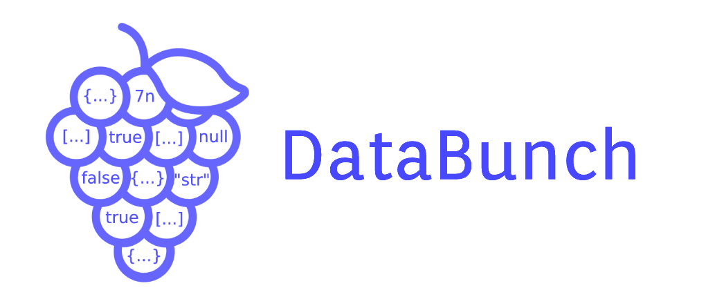
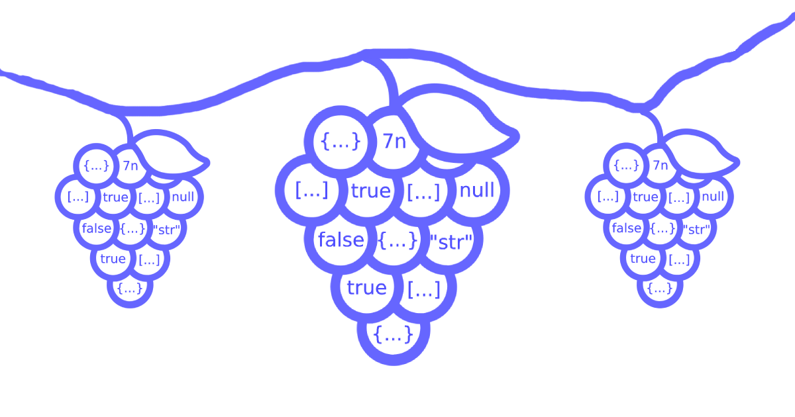

DataBunch is a JavaScript library based on the [Observer Design Pattern](https://en.wikipedia.org/wiki/Observer_pattern).
It is designed to subscribe to data and makes it easy to use.

### Installation
    npm i data-bunch

First, we must ```import DataBunch from "data-bunch";```

### Usage

DataBunch is a class and as a props of the constructor, you can specify an object, and in the object - 2 properties.
- initialValues (object)
- watcher (function)

``` javascript
const initialValues = {
    users: [],
    profile: {}
};

const watcher = (allValues = {}) => {
    console.info(allValues);
};

const dataBunch = new DataBunch({ initialValues, watcher });
```
Instance of DataBunch has 4 methods.
- set
- get
- subscribe
- reset

# set
> The [ set ] method is a function that takes 1 argument (object) and in the object we can define our data keys (which we defined in the initial values in the constructor properties) with their new values.
> Also, if we give a function instead of a new value, the argument to that function will get the previous value, and the function's return value will be our new value.

``` javascript
// examples

dataBunch.set({
    "users": [{ id: 1 }, { id: 2 }, { id: 3 }], // with new value
    "profile": prevValue => ({ ...prevValue, age: 33 }) // with previous value
});

```
# get
> The [ get ] method is a function that takes one or more arguments.
> We pass the data keys to the method as arguments, the values of which we want to get.
> This method returns an object according to the data keys.
``` javascript
// example

const { users, profile } = dataBunch.get("users", "profile");
```
> But if we want to subscribe to data and always have the latest data, we must use the [ subscribe ] method.

# subscribe
> The [ subscribe ] method is a function that takes 1 argument (object) and in the object we can define our data keys with their callbacks.
> When we use the [set] method with a data key, the corresponding callback function in the [ subscribe ] method will be called.

``` javascript
// example

const subscription = dataBunch.subscribe({
    "users": value => console.info("users", value),
    "profile": value => console.info("profile", value)
});
```
> Any subscription returns an object containing the [ unsubscribe ] method.
> At some point, when we want to unsubscribe, we can use these ways.
> - In case of calling without arguments, all the callback functions for the given that subscription, will be unsubscribed.
> - In case of calling with arguments, will be unsubscribed only the corresponding data key callbacks.

``` javascript
// examples

subscription.unsubscribe(); // all the callback functions will be unsubscribed

subscription.unsubscribe("users", ...); // will be unsubscribed only the corresponding data key callbacks
```
# reset
> The [ reset ] method is a function, that we can call with or without arguments. 
> - In case of calling without arguments, all values in the DataBunch will revert to their initial values.
> - In case of calling with arguments, only values with the corresponding data key will revert to their initial values.

``` javascript
// examples

dataBunch.reset(); // all values in the DataBunch will revert to their initial values

dataBunch.reset("users", ...); // only values with the corresponding data key will revert to their initial values
```

---
## And what about a lot of mixed data?
You can easily create multiple instance of the DataBunch by separating the data.

``` javascript
// examples

export const dataBunch = new DataBunch({ initialValues, ... });

export const statisticsDataBunch = new DataBunch({ initialStatisticsValues, ... });

export const modalsDataBunch = new DataBunch({ initialModalsValues, ... });
```
---

And also you can see how to use DataBunch in React or React Native from the in [ data-bunch-example ](https://github.com/HamoMinasyan/data-bunch-example/tree/main/src) project.

Thanks!